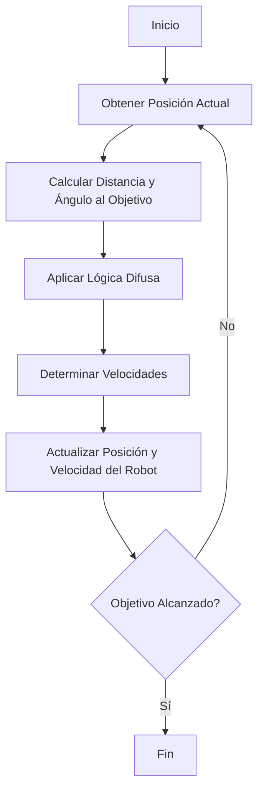

# 🤖 Documentación del Proyecto de Control de Robot con Lógica Difusa 🧠

## 🌟 Introducción

Este proyecto utiliza la **lógica difusa** para controlar un robot y guiarlo a lo largo de una trayectoria definida. La lógica difusa permite manejar la incertidumbre y la ambigüedad en la toma de decisiones, lo que es especialmente útil en entornos donde las condiciones pueden variar y no son completamente predecibles.

El robot se mueve a lo largo de una serie de segmentos, que pueden ser lineales o curvos. El objetivo es que el robot siga la trayectoria de manera precisa, ajustando su velocidad y dirección en función de su posición actual y la del objetivo.

## 📂 Estructura del Proyecto

El proyecto se compone de varios módulos y clases que trabajan en conjunto para lograr el control del robot. A continuación, se describen las principales clases y su función:

### 🚀 Clase `Launcher`

La clase `Launcher` es responsable de iniciar y coordinar el proceso de control del robot. Esta clase se encarga de:

- 🔧 Configurar el entorno y los parámetros iniciales.
- 🚦 Iniciar el ciclo de control del robot.
- 📡 Gestionar la comunicación entre el robot y el sistema de lógica difusa.

### 🤖 Clase `Robot`

La clase `Robot` representa al robot en sí. Contiene información sobre:

- 📍 La posición actual del robot.
- 🚗 La velocidad lineal y angular.
- 🔄 Métodos para actualizar la posición y velocidad del robot.

### 🛤️ Clase `Segmento`

La clase `Segmento` define los segmentos de la trayectoria que el robot debe seguir. Cada segmento puede ser:

- 📏 Lineal: Un segmento recto entre dos puntos.
- 🔄 Curvo: Un segmento curvo definido por tres puntos (inicio, medio, fin).

### 🧠 Clase `FuzzyExpert`

La clase `FuzzyExpert` es el núcleo del sistema de lógica difusa. Esta clase se encarga de:

- 📊 Definir las variables difusas (distancia, ángulo, velocidad lineal, velocidad angular).
- 📜 Establecer las reglas difusas que determinan cómo se ajustan las velocidades en función de la distancia y el ángulo.
- 🧩 Realizar la inferencia difusa para calcular las velocidades óptimas del robot.

## 📦 Variables en el Constructor de `FuzzyExpert`

El constructor de la clase `FuzzyExpert` inicializa varias variables importantes:

- **Estados Generales**:
  - `objetivoAlcanzado`: Indica si el robot ha alcanzado su objetivo.
  - `segmentoObjetivo`: Segmento objetivo actual.
  - `VOLVER_AL_INICIO`: Indica si el robot debe regresar al inicio.
  - `FRENAR`: Indica si el robot debe frenar.

- **Velocidades y Movimiento**:
  - `velocidad`: Velocidad lineal inicial.
  - `velocidad_angular`: Velocidad angular inicial.
  - `reverse`: Indica si el robot está en modo reversa.
  - `distance`: Distancia al objetivo actual.

- **Parámetros de Trayectoria Lineal**:
  - `check_point_segmento`: Índice del punto de control actual.
  - `LINE_CHECKPOINTS`: Total de puntos de control en trayectoria lineal.
  - `line_trayectory`: Coordenadas de la trayectoria lineal.
  - `start_point`: Punto de inicio de la trayectoria.
  - `segment_number`: Número del segmento actual.
  - `STOP_DISTANCE`: Distancia para detenerse al final del segmento.
  - `CHECKPOINT_DISTANCE_ACTIVATOR`: Distancia que activa cambio de punto de control.
  - `CONSTANTE_AUMENTAR_VELOCIDAD`: Constante para aumentar velocidad.
  - `FIRST_SEGMENT_INDEX`: Índice del primer segmento.
  - `TOTAL_SEGMENT_NUMBER`: Número total de segmentos.

- **Parámetros de Trayectoria Triangular**:
  - `check_point_triangulo`: Índice del punto de control actual en trayectoria triangular.
  - `TRIANGLE_CHECKPOINTS`: Total de puntos de control en trayectoria triangular.
  - `triangle_trayectory`: Coordenadas de la trayectoria triangular.
  - `CONTROL_POINT_CONSTANT`: Constante para ajustar los puntos de control.
  - `MINIMUM_DISTANCE_TRIANGLE_CP`: Distancia mínima para activar puntos de control.

## 📜 Reglas Difusas y Variables

El sistema de lógica difusa utiliza varias variables difusas para tomar decisiones:

- **Distancia**: Define cuán cerca o lejos está el robot del objetivo.
  - `super_close`: Muy cerca.
  - `close`: Cerca.
  - `far`: Lejos.

- **Ángulo**: Define el ángulo entre la dirección actual del robot y la dirección hacia el objetivo.
  - `super_small`: Muy pequeño.
  - `small`: Pequeño.
  - `medium`: Medio.
  - `large`: Grande.

- **Velocidad Lineal**: Define la velocidad lineal del robot.
  - `super_slow`: Muy lenta.
  - `slow`: Lenta.
  - `super_fast`: Muy rápida.

- **Velocidad Angular**: Define la velocidad angular del robot.
  - `super_slow`: Muy lenta.
  - `slow`: Lenta.
  - `medium`: Media.
  - `fast`: Rápida.

### 📝 Reglas Difusas

Las reglas difusas combinan las variables difusas para determinar las velocidades óptimas. Algunos ejemplos de reglas son:

- Si la distancia es `super_close` y el ángulo es `super_small`, entonces la velocidad lineal es `super_slow` y la velocidad angular es `super_slow`.
- Si la distancia es `far` y el ángulo es `large`, entonces la velocidad lineal es `super_fast` y la velocidad angular es `fast`.

## 🛠️ Métodos de la Clase `FuzzyExpert`

La clase `FuzzyExpert` contiene varios métodos clave para el control del robot. A continuación, se describen estos métodos en detalle:

### `generate_linear_path(A, B)`

**Descripción**: Genera una trayectoria lineal entre dos puntos `A` y `B`, dividiendo el segmento en puntos equidistantes.

**Parámetros**:
- `A (tuple)`: Coordenadas del punto inicial (x1, y1).
- `B (tuple)`: Coordenadas del punto final (x2, y2).

**Retorno**:
- `list`: Lista de puntos (x, y) que forman la trayectoria lineal desde `A` hasta `B`.

**Detalles**:
1. Calcula las coordenadas de los puntos intermedios dividiendo el segmento entre `A` y `B` en `LINE_CHECKPOINTS + 1` partes.
2. Añade el punto inicial (`A`) y el punto final (`B`) a la lista de resultados.
3. Redondea las coordenadas de los puntos intermedios a 6 decimales para mejorar la precisión.

### `cubic_bezier(t, P0, P1, P2, P3)`

**Descripción**: Calcula un punto en una curva de Bézier cúbica para un valor dado de `t`.

**Parámetros**:
- `t (float)`: Parámetro de la curva, en el rango [0, 1].
- `P0 (float)`: Coordenada inicial de la curva.
- `P1 (float)`: Primer punto de control.
- `P2 (float)`: Segundo punto de control.
- `P3 (float)`: Coordenada final de la curva.

**Retorno**:
- `float`: Coordenada calculada en la curva de Bézier cúbica para el valor de `t`.

**Detalles**:
- Utiliza la fórmula estándar para una curva de Bézier cúbica: `(1 - t)^3 * P0 + 3 * (1 - t)^2 * t * P1 + 3 * (1 - t) * t^2 * P2 + t^3 * P3`.
- La curva es definida por los puntos de control (`P0`, `P1`, `P2`, `P3`), proporcionando una interpolación suave entre `P0` y `P3`.

### `calcular_offset(A, B, C)`

**Descripción**: Calcula el offset de un punto respecto a una línea definida por dos puntos.

**Parámetros**:
- `A (tuple)`: Coordenadas del punto `A`, que define el inicio de la línea (x1, y1).
- `B (tuple)`: Coordenadas del punto `B`, que define el final de la línea (x2, y2).
- `C (tuple)`: Coordenadas del punto `C`, desde donde se calcula el offset respecto a la línea `AB`.

**Retorno**:
- `float`: Offset calculado, limitado entre 0.5 y 5.

**Detalles**:
1. Calcula la longitud de la base (distancia entre `A` y `B`) usando la distancia euclidiana.
2. Calcula la altura perpendicular desde el punto `C` hasta la línea `AB` mediante la fórmula de la distancia punto-línea.
3. Normaliza el offset utilizando una fórmula específica: `1.5 + (0.5 * (altura / (longitud_base + 1)))`.
4. Asegura que el offset esté dentro del rango especificado [0.5, 5].

### `calculate_control_points(B, C, D)`

**Descripción**: Calcula los puntos de control para una curva basada en tres puntos dados.

**Parámetros**:
- `B (tuple)`: Coordenadas del primer punto de la curva (x1, y1).
- `C (tuple)`: Coordenadas del segundo punto de la curva (x2, y2).
- `D (tuple)`: Coordenadas del tercer punto de la curva (x3, y3).

**Retorno**:
- `tuple`: 
  - `CP1 (numpy.ndarray)`: Primer punto de control calculado.
  - `CP2 (numpy.ndarray)`: Segundo punto de control calculado.

**Detalles**:
1. Calcula los vectores de dirección entre los puntos `B → C` y `C → D`.
2. Normaliza estos vectores para obtener direcciones perpendiculares.
3. Calcula un offset dinámico utilizando el método `calcular_offset`, que ajusta el desplazamiento de los puntos de control.
4. Determina las posiciones de `CP1` y `CP2` sumando los desplazamientos proporcionales al vector de dirección y al offset.

### `generate_curved_path(B, C, D, CP1, CP2)`

**Descripción**: Genera una trayectoria curva utilizando dos secciones de curvas Bézier cúbicas.

**Parámetros**:
- `B (tuple)`: Coordenadas del primer punto de la trayectoria (x1, y1).
- `C (tuple)`: Coordenadas del punto intermedio de la trayectoria (x2, y2).
- `D (tuple)`: Coordenadas del punto final de la trayectoria (x3, y3).
- `CP1 (numpy.ndarray)`: Primer punto de control para la curva de `B` a `C`.
- `CP2 (numpy.ndarray)`: Segundo punto de control para la curva de `C` a `D`.

**Retorno**:
- `numpy.ndarray`: Array de puntos que forman la trayectoria curva completa.

**Detalles**:
1. Divide la trayectoria en dos partes:
   - Primera curva Bézier cúbica desde `B` a `C`, usando `CP1` como punto de control.
   - Segunda curva Bézier cúbica desde `C` a `D`, usando `CP2` como punto de control.
2. Calcula los puntos de la curva para cada sección utilizando el método `cubic_bezier`.
3. Genera un conjunto de puntos equidistantes a lo largo de cada sección con `TRIANGLE_CHECKPOINTS`.
4. Combina ambas secciones para formar la trayectoria completa.

### `setObjetivo(obj)`

**Descripción**: Establece el objetivo actual del robot.

**Parámetros**:
- `obj`: Objeto que representa el segmento objetivo.

**Detalles**:
- Marca el objetivo como no alcanzado (`objetivoAlcanzado = False`).
- Asigna el segmento objetivo actual (`segmentoObjetivo = obj`).

### `tomarDecision(poseRobot)`

**Descripción**: Determina las velocidades lineal y angular del robot basadas en la posición actual y el objetivo.

**Parámetros**:
- `poseRobot (tuple)`: Pose actual del robot, que incluye las coordenadas (x, y), el ángulo actual y otros datos adicionales.

**Retorno**:
- `tuple`: Una tupla con las velocidades calculadas:
  - Velocidad lineal (`V`)
  - Velocidad angular (`W`)

**Raises**:
- `KeyError`: Si faltan variables o reglas en el sistema de inferencia difusa.

**Detalles**:
1. Extrae las coordenadas actuales y el ángulo del robot.
2. Calcula la distancia y el ángulo hacia el objetivo.
3. Utiliza un sistema de inferencia difusa para determinar las velocidades óptimas.
4. Verifica la proximidad al objetivo para detener el movimiento cuando sea necesario.

### `obtener_coordenadas_objetivo()`

**Descripción**: Obtiene las coordenadas del objetivo basándose en el tipo y estado del segmento actual.

**Retorno**:
- `tuple`: Coordenadas del objetivo (`x_target`, `y_target`).

**Detalles**:
1. Comprueba el tipo de segmento:
   - Si el segmento es lineal (tipo 1), genera una trayectoria lineal o utiliza puntos de inicio/fin.
   - Si el segmento es triangular, calcula los puntos de control y genera una trayectoria curva.
2. Determina el punto objetivo basado en el progreso actual (`check_point_segmento` o `check_point_triangulo`).
3. Gestiona la variable `FRENAR` dependiendo de la proximidad al objetivo o la trayectoria completada.

### `calcular_angulo(x_target, y_target, x_robot, y_robot, current_angle)`

**Descripción**: Calcula el ángulo de giro necesario para que el robot apunte hacia un objetivo.

**Parámetros**:
- `x_target (float)`: Coordenada X del objetivo.
- `y_target (float)`: Coordenada Y del objetivo.
- `x_robot (float)`: Coordenada X actual del robot.
- `y_robot (float)`: Coordenada Y actual del robot.
- `current_angle (float)`: Ángulo actual del robot en grados.

**Retorno**:
- `float`: Ángulo de giro en grados, normalizado dentro del rango [0°, 360°].

**Detalles**:
1. Calcula el ángulo objetivo en radianes utilizando `atan2` para determinar la dirección hacia el objetivo.
2. Convierte el ángulo objetivo de radianes a grados para mayor interpretabilidad.
3. Normaliza tanto el ángulo objetivo como el ángulo actual del robot para garantizar que estén dentro del rango de 0° a 360°.
4. Calcula la diferencia angular (ángulo de giro necesario) entre el ángulo objetivo y el ángulo actual.
5. Normaliza la diferencia angular para evitar valores fuera del rango esperado.

### `normalize_angle(angle)`

**Descripción**: Normaliza un ángulo para evitar valores fuera del rango esperado.

**Parámetros**:
- `angle (float)`: Ángulo a normalizar.

**Retorno**:
- `float`: Ángulo normalizado dentro del rango [-180°, 180°].

**Detalles**:
- Ajusta el ángulo para que esté dentro del rango de -180° a 180°.

### `verificar_proximidad_objetivo(distance)`

**Descripción**: Verifica si el robot está lo suficientemente cerca del objetivo y actualiza los estados de proximidad y checkpoints.

**Parámetros**:
- `distance (float)`: Distancia actual entre el robot y el objetivo.

**Detalles**:
1. Para segmentos lineales:
   - Si la distancia al objetivo es menor o igual a `STOP_DISTANCE` y el robot está en el último checkpoint del segmento:
     - Marca el objetivo como alcanzado (`objetivoAlcanzado`).
     - Incrementa el número de segmento (`segment_number`).
     - Reinicia el checkpoint (`check_point_segmento`) para preparar el próximo segmento.
     - Si está activada la opción `VOLVER_AL_INICIO`, ajusta la lógica para continuar el trayecto cíclicamente.
   - Si la distancia es menor a `CHECKPOINT_DISTANCE_ACTIVATOR` y aún hay checkpoints disponibles:
     - Avanza al siguiente checkpoint (`check_point_segmento`).

2. Para segmentos curvos (triangulares):
   - Si la distancia al objetivo es menor o igual a 0.5 y el robot está en el último checkpoint del segmento:
     - Marca el objetivo como alcanzado.
     - Reinicia el checkpoint del segmento triangular.
     - Incrementa el número de segmento.
   - Si la distancia al siguiente checkpoint es menor o igual a `MINIMUM_DISTANCE_TRIANGLE_CP`:
     - Avanza al siguiente checkpoint del segmento triangular.

### `esObjetivoAlcanzado()`

**Descripción**: Indica si el robot ha alcanzado su objetivo.

**Retorno**:
- `bool`: `True` si el objetivo ha sido alcanzado, `False` en caso contrario.

### `hayParteOptativa()`

**Descripción**: Indica si hay una parte opcional en la trayectoria.

**Retorno**:
- `bool`: `True` si hay una parte opcional, `False` en caso contrario.

## 🔄 Ciclo de Trabajo del Robot

El ciclo de trabajo del robot se puede representar gráficamente de la siguiente manera:

## 🎨 Detalles Adicionales

El sistema de lógica difusa utilizado en este proyecto es robusto y flexible, permitiendo ajustes finos en las reglas y variables para adaptarse a diferentes escenarios y condiciones. La combinación de trayectorias lineales y curvas permite al robot seguir una ruta compleja con precisión.

El uso de puntos de control y la generación dinámica de trayectorias aseguran que el robot pueda manejar cambios en la ruta sin necesidad de una reconfiguración completa del sistema.

Este proyecto es una excelente demostración de cómo la lógica difusa puede ser aplicada en sistemas de control de robots, proporcionando una solución efectiva para problemas de navegación y seguimiento de trayectorias.

---

🎉 ¡Gracias por leer la documentación! Si tienes alguna pregunta o necesitas más detalles, no dudes en preguntar. ¡Disfruta explorando el mundo de la lógica difusa y la robótica! 🤖🧠
