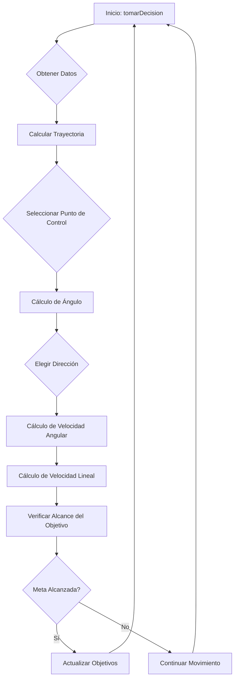

# 🤖 Sistema Experto Basado en Lógica Difusa para Control de Robots

Este proyecto implementa un sistema experto basado en lógica difusa en Python para controlar el movimiento de un robot móvil en un entorno simulado sin obstáculos. El objetivo es que el robot recorra un segmento de línea en el plano con precisión y eficiencia. Para lograr esto, el proyecto está estructurado en varias clases que gestionan diferentes aspectos de la simulación y el control del robot.

## 🎯 Sistema Experto Basado en Lógica Difusa

### Descripción de las Clases

#### 1. `P1Launcher.py`
Esta clase inicializa y gestiona el entorno gráfico, asegurando la comunicación entre todos los objetos que intervienen en la simulación. Además, incluye los métodos necesarios para dibujar los elementos en la pantalla.

#### 2. `Robot.py`
Esta clase representa al robot móvil, almacenando su pose actual (posición y orientación en el plano) y procesando los comandos de velocidad lineal y angular que recibe del sistema experto. Internamente, esta clase se encarga de actualizar la pose del robot de acuerdo a su dinámica de movimiento, pero no se interactúa directamente con ella. Los datos de la pose del robot se utilizan como entrada en el sistema experto.

#### 3. `Objetivo.py`
Esta clase define un segmento lineal que representa el camino que el robot debe seguir en el plano. También permite configurar un triángulo de restricción: un área triangular definida por tres vértices donde el robot no debe ingresar. Esta configuración es especialmente útil para ejercicios avanzados en los que el robot debe evitar ciertas áreas mientras sigue el segmento objetivo.

#### 4. `fuzzyExpert.py`
Esta clase es el núcleo del proyecto, en la que se implementa el sistema experto basado en lógica difusa. En ella se desarrollan los métodos para calcular, en cada instante, los comandos de velocidad lineal y angular que el robot debe seguir para alcanzar el objetivo. Estos comandos se generan en función de la pose del robot y del segmento objetivo configurado.

---

## 🔍 Clase: FuzzySystem

### Índice

1. [Parámetros de Inicialización](#parámetros-de-inicialización)
   - [Indicadores y Estados de Trayectoria](#indicadores-y-estados-de-trayectoria)
   - [Parámetros de Velocidad y Movimiento](#parámetros-de-velocidad-y-movimiento)
   - [Parámetros de la Trayectoria Lineal](#parámetros-de-la-trayectoria-lineal)
   - [Parámetros de la Trayectoria Triangular](#parámetros-de-la-trayectoria-triangular)
   - [Ángulos y Control de Giro](#ángulos-y-control-de-giro)
   
2. [Métodos Principales](#métodos-principales)
   - [tomarDecision](#tomardecision)
   - [obtener_coordenadas_objetivo](#obtener_coordenadas_objetivo)
   - [generate_linear_path](#generate_linear_path)
   - [cubic_bezier](#cubic_bezier)
   - [calcular_offset](#calcular_offset)
   - [calculate_control_points](#calculate_control_points)
   - [generate_curved_path](#generate_curved_path)
   - [calcular_angulo](#calcular_angulo)
   - [verificar_proximidad_objetivo](#verificar_proximidad_objetivo)
   - [normalize_angle](#normalize_angle)
   - [esObjetivoAlcanzado](#esobjetivoalcanzado)
   - [hayParteOptativa](#hayparteoptativa)

---

## Parámetros de Inicialización

### Indicadores y Estados de Trayectoria
| Parámetro | Tipo | Descripción |
| --- | --- | --- |
| `objetivoAlcanzado` | `bool` | Indicador de si el robot ha alcanzado su objetivo final. |
| `segmentoObjetivo` | `object` | Segmento de destino actual en el trayecto. |
| `VOLVER_AL_INICIO` | `bool` | Controla si el robot debe regresar al punto inicial del trayecto. |
| `FRENAR` | `bool` | Indica si el robot debe frenar. |

### Parámetros de Velocidad y Movimiento
| Parámetro | Tipo | Descripción |
| --- | --- | --- |
| `velocidad` | `float` | Velocidad lineal inicial (en m/s). |
| `velocidad_angular` | `float` | Velocidad angular inicial (en rad/s). |
| `reverse` | `bool` | Modo de reversa inicial. |

### Parámetros de la Trayectoria Lineal
| Parámetro | Tipo | Descripción |
| --- | --- | --- |
| `check_point_segmento` | `int` | Estado del trayecto (punto inicial (False) o final (True)). |
| `LINE_CHECKPOINTS` | `int` | Cantidad de puntos de control en trayecto lineal. |
| `line_trayectory` | `list` | Lista de coordenadas del trayecto lineal. |
| `start_point` | `tuple` | Punto de inicio del trayecto. |
| `segment_number` | `int` | Número del segmento actual. |
| `distance` | `int` | Distancia hasta el punto objetivo. |
| `STOP_DISTANCE` | `float` | Distancia para detener el robot al final del segmento. |
| `CHECKPOINT_DISTANCE_ACTIVATOR` | `float` | Distancia que activa el cambio de punto de control. |
| `CONSTANTE_AUMENTAR_VELOCIDAD` | `float` | Constante para aumentar velocidad en trayecto. |
| `FIRST_SEGMENT_INDEX` | `int` | Índice del primer segmento del trayecto. |
| `TOTAL_SEGMENT_NUMBER` | `int` | Número total de segmentos en el trayecto. |

### Parámetros de la Trayectoria Triangular
| Parámetro | Tipo | Descripción |
| --- | --- | --- |
| `check_point_triangulo` | `int` | Contador de puntos de control en el trayecto triangular. |
| `TRIANGLE_CHECKPOINTS` | `int` | Cantidad de puntos de control en trayecto triangular. |
| `triangle_trayectory` | `list` | Lista de coordenadas del trayecto triangular. |
| `CONTROL_POINT_CONSTANT` | `float` | Constante de ajuste de puntos de control en trayecto triangular. |
| `MINIMUM_DISTANCE_TRIANGLE_CP` | `int` | Distancia mínima para activar puntos de control. |

### Ángulos y Control de Giro
| Parámetro | Tipo | Descripción |
| --- | --- | --- |
| `turn_angle_rad` | `float` | Ángulo de giro en radianes. |
| `turn_angle_deg` | `float` | Ángulo de giro en grados. |
| `REVERSE_THRESHOLD` | `int` | Umbral en grados para activar marcha atrás. |
| `MAXIMUM_ANGLE_DEG` | `int` | Ángulo máximo antes de desviarse del trayecto. |
| `DISTANCE_TURN_CONSTANT` | `float` | Constante para ajustar el ángulo máximo según la distancia. |
| `VELOCIDAD_ANGULAR_CONSTANT` | `int` | Constante para ajustar velocidad angular en giros. |

---

## Métodos Principales

### `tomarDecision`
Determina las velocidades lineal y angular del robot basadas en la posición actual y el objetivo.

**Parámetros:**
- `poseRobot` (tuple): Pose actual del robot, que incluye las coordenadas (x, y), el ángulo actual y otros datos adicionales.

**Retorna:**
- `tuple`: Una tupla con las velocidades calculadas:
  - Velocidad lineal (V)
  - Velocidad angular (W)

**Detalles:**
1. Extrae las coordenadas actuales y el ángulo del robot.
2. Calcula la distancia y el ángulo hacia el objetivo.
3. Utiliza un sistema de inferencia difusa para determinar las velocidades óptimas.
4. Verifica la proximidad al objetivo para detener el movimiento cuando sea necesario.

### `obtener_coordenadas_objetivo`
Obtiene las coordenadas del objetivo basándose en el tipo y estado del segmento actual.

**Retorna:**
- `tuple`: Coordenadas del objetivo (x_target, y_target).

**Detalles:**
1. Comprueba el tipo de segmento:
   - Si el segmento es lineal (tipo 1), genera una trayectoria lineal o utiliza puntos de inicio/fin.
   - Si el segmento es triangular, calcula los puntos de control y genera una trayectoria curva.
2. Determina el punto objetivo basado en el progreso actual (check_point_segmento o check_point_triangulo).
3. Gestiona la variable `FRENAR` dependiendo de la proximidad al objetivo o la trayectoria completada.

### `generate_linear_path`
Genera una trayectoria lineal entre dos puntos, dividiendo el segmento en puntos equidistantes.

**Parámetros:**
- `A` (tuple): Coordenadas del punto inicial (x1, y1).
- `B` (tuple): Coordenadas del punto final (x2, y2).

**Retorna:**
- `list`: Lista de puntos (x, y) que forman la trayectoria lineal desde A hasta B.

### `cubic_bezier`
Calcula un punto en una curva de Bézier cúbica para un valor dado de `t`.

**Parámetros:**
- `t` (float): Parámetro de la curva, en el rango [0, 1].
- `P0` (float): Coordenada inicial de la curva.
- `P1` (float): Primer punto de control.
- `P2` (float): Segundo punto de control.
- `P3` (float): Coordenada final de la curva.

**Retorna:**
- `float`: Coordenada calculada en la curva de Bézier cúbica para el valor de `t`.

### `calcular_offset`
Calcula el offset de un punto respecto a una línea definida por dos puntos.

**Parámetros:**
- `A` (tuple): Coordenadas del punto A, que define el inicio de la línea (x1, y1).
- `B` (tuple): Coordenadas del punto B, que define el final de la línea (x2, y2).
- `C` (tuple): Coordenadas del punto C, desde donde se calcula el offset respecto a la línea AB.

**Retorna:**
- `float`: Offset calculado, limitado entre 0.5 y 5.

### `calculate_control_points`
Calcula los puntos de control para una curva basada en tres puntos dados.

**Parámetros:**
- `B` (tuple): Coordenadas del primer punto de la curva (x1, y1).
- `C` (tuple): Coordenadas del segundo punto de la curva (x2, y2).
- `D` (tuple): Coordenadas del tercer punto de la curva (x3, y3).

**Retorna:**
- `tuple`: 
  - `CP1` (numpy.ndarray): Primer punto de control calculado.
  - `CP2` (numpy.ndarray): Segundo punto de control calculado.

### `generate_curved_path`
Genera una trayectoria curva utilizando dos secciones de curvas Bézier cúbicas.

**Parámetros:**
- `B` (tuple): Coordenadas del primer punto de la trayectoria (x1, y1).
- `C` (tuple): Coordenadas del punto intermedio de la trayectoria (x2, y2).
- `D` (tuple): Coordenadas del punto final de la trayectoria (x3, y3).
- `CP1` (numpy.ndarray): Primer punto de control para la curva de B a C.
- `CP2` (numpy.ndarray): Segundo punto de control para la curva de C a D.

**Retorna:**
- `numpy.ndarray`: Array de puntos que forman la trayectoria curva completa.

### `calcular_angulo`
Calcula el ángulo de giro necesario para que el robot apunte hacia un objetivo.

**Parámetros:**
- `x_target` (float): Coordenada X del objetivo.
- `y_target` (float): Coordenada Y del objetivo.
- `x_robot` (float): Coordenada X actual del robot.
- `y_robot` (float): Coordenada Y actual del robot.
- `current_angle` (float): Ángulo actual del robot en grados.

**Retorna:**
- `float`: Ángulo de giro en grados, normalizado dentro del rango [0°, 360°].

### `verificar_proximidad_objetivo`
Verifica si el robot está lo suficientemente cerca del objetivo y actualiza los estados de proximidad y checkpoints.

**Parámetros:**
- `distance` (float): Distancia actual entre el robot y el objetivo.

### `normalize_angle`
Normaliza un ángulo para que esté dentro del rango [-180, 180).

**Parámetro:**
- `angle` (float): Ángulo a normalizar.

**Retorna:**
- Ángulo normalizado (float).

### `esObjetivoAlcanzado`
Devuelve `True` cuando el punto final del objetivo ha sido alcanzado.

**Retorna:**
- `bool`: `True` si el objetivo ha sido alcanzado, de lo contrario `False`.

### `hayParteOptativa`
Método para verificar si hay una parte optativa en el proceso.

**Retorna:**
- `bool`: `True` si hay una parte optativa, de lo contrario `False`.

---

## 🚀 **Lógica del Código**

La base del programa es la función `tomarDecision`, que se llama de forma continua para controlar el movimiento del robot. Esta función realiza las siguientes acciones:

### 🔍 1. **Obtención de Datos y Cálculo de la Trayectoria**

La función reúne todos los datos necesarios para construir la trayectoria de movimiento. Para esto, se añaden puntos de control intermedios en cada segmento del camino: en segmentos rectos y en segmentos triangulares. Para cada tipo de segmento, se utilizan los métodos correspondientes definidos en la clase, lo que asegura que los puntos de control se establezcan correctamente.

### 📐 **Algoritmo de `obtener_coordenadas_objetivo`**

El algoritmo en la función `obtener_coordenadas_objetivo` está diseñado para obtener las coordenadas del objetivo del robot en función de su estado actual y posición, así como del tipo de trayectoria. La función considera si el robot se mueve a lo largo de una línea o un triángulo y actualiza dinámicamente las coordenadas del objetivo. Esto permite al robot seguir una trayectoria compleja correctamente, reaccionando a los cambios en el camino.

#### 📋 **Lógica General y Estructura de la Función**

1. **Determinación del Tipo de Trayectoria**  
   Primero, la función verifica el tipo de camino por el que se mueve el robot, ya sea una línea (segmento) o un triángulo.

2. **Retorno al Inicio (si es Necesario)**  
   Si el robot ha alcanzado el punto final de la ruta y necesita regresar al punto de inicio, la función devuelve las coordenadas del primer checkpoint.

#### 📈 **Generación de Trayectoria para el Segmento**

Para una línea, la función utiliza el método `generate_linear_path`, que forma una trayectoria recta entre dos puntos (inicio y fin del segmento). El proceso es el siguiente:

1. **Determinación de las Coordenadas de Inicio y Fin**  
   Usando las coordenadas de inicio y fin del segmento, la función divide el camino en un número determinado de puntos intermedios, definiendo una secuencia precisa de movimiento.

2. **Comprobación de los Checkpoints**  
   La función determina si el robot está en el inicio, en el medio o en el final del segmento. Si es el checkpoint inicial, se empieza a generar la trayectoria; si es el último checkpoint, el robot se detiene o se da la vuelta según las condiciones actuales.

3. **Movimiento a lo Largo de la Trayectoria**  
   En cada paso, la función actualiza las coordenadas del objetivo, asegurando un movimiento fluido a lo largo de la línea. La trayectoria lineal es simple y no requiere cálculos adicionales para ajustar la dirección.

#### 📐 **Generación de Trayectoria para el Triángulo**

Para el movimiento a lo largo de una trayectoria triangular, la función utiliza el algoritmo de Bézier. La generación de una trayectoria triangular es más compleja, ya que requiere la creación de curvas suaves.

1. **Algoritmo de Bézier**  
   El algoritmo de Bézier permite crear curvas suaves, lo cual es importante para mover al robot en una trayectoria de forma no estándar, como un triángulo. Este algoritmo utiliza cuatro puntos de control para crear una curva que conecta suavemente el inicio, el medio y el fin de la trayectoria triangular. La función `cubic_bezier` se encarga de calcular las posiciones a lo largo de esta curva en cada segmento.

2. **Generación del Camino Curvo**  
   Primero, la función determina dos puntos de control intermedios (CP1 y CP2), que definen la forma de la curva. Usando `generate_trajectory`, la función crea dos curvas de Bézier: una que conecta el primer y segundo puntos del triángulo, y otra que conecta el segundo y tercer puntos.

3. **Movimiento a lo Largo de la Trayectoria**  
   El robot se mueve a lo largo de los puntos calculados en la trayectoria, cumpliendo un número determinado de checkpoints para cada parte del triángulo. Esto asegura un movimiento fluido y preciso en la trayectoria triangular, algo que no se podría lograr con una interpolación lineal.

### 🔄 2. **Selección de Dirección y Cálculo del Ángulo de Giro**

Después de crear la trayectoria y seleccionar el punto de control adecuado, se calcula el ángulo necesario para girar. Dependiendo del ángulo, se elige el modo de movimiento: avance o marcha atrás (reversa). Si es necesario retroceder, se ejecutan funciones adicionales para implementar el movimiento en reversa.

### 🧭 **Definir la Dirección de Movimiento y el Ángulo de Giro**

1. **Calcular el Ángulo hacia el Objetivo**  
   Utilizando el método `calcular_angulo`.

2. **Elegir la Dirección de Movimiento**  
   Basado en la diferencia de ángulos con la dirección actual del robot, mediante la función `decidir_modo_movimiento`.

### 🔧 **Detalles del Funcionamiento de las Funciones**

#### 🔢 `calcular_angulo`

| **Parámetros de Entrada** | **Descripción**                      |
|---------------------------|--------------------------------------|
| `x_target`, `y_target`    | Coordenadas del objetivo             |
| `x_robot`, `y_robot`      | Coordenadas actuales del robot       |
| `current_angle`           | Ángulo actual de orientación (°)     |

**Proceso:**

1. **Cálculo del Ángulo hacia el Objetivo**  
   Determina el ángulo desde el robot hasta el objetivo usando `atan2`.

2. **Conversión a Grados**  
   Convierte el ángulo de radianes a grados.

3. **Normalización de los Ángulos**  
   Normaliza el ángulo hacia el objetivo y el ángulo actual del robot.

4. **Cálculo de la Diferencia Angular**  
   Calcula la diferencia entre el ángulo hacia el objetivo y la dirección actual del robot.

### 🏎️ 3. **Cálculo de la Velocidad Angular y Lineal**

Según la posición actual del robot y la dirección elegida, se calculan la velocidad angular y lineal. También se determina la distancia al punto de destino para establecer correctamente la velocidad lineal, lo que permite un movimiento suave.

### 🧮 **Lógica General y Estructura de la Función**

1. **Cálculo de la Velocidad Angular**  
   Método: `calcular_velocidad_angular`

2. **Cálculo de la Distancia al Objetivo**  
   Método: `calcular_distancia_objetivo`

3. **Cálculo de la Velocidad Lineal**  
   Método: `calcular_velocidad_lineal`

### 🎯 4. **Verificación de Alcance de la Meta**

En cada etapa, se verifica si el robot ha alcanzado su punto de destino. Si se ha llegado a la meta, el movimiento continúa hacia el siguiente punto de control o termina.

### 🧩 **Lógica General y Estructura de la Función**

El método `verificar_proximidad_objetivo` gestiona la proximidad del robot al objetivo y la lógica asociada para detenerse, activar puntos de control y reducir la velocidad suavemente.

### 🏁 5. **Retorno de Parámetros de Velocidad**

Al finalizar, la función devuelve los valores de velocidad lineal y angular, los cuales se transmiten para controlar el movimiento del robot.

```python
return self.velocidad, self.velocidad_angular
```

---

## 📊 **Diagrama de Flujo de la Función `tomarDecision`**



---

## 📚 **Resumen de Métodos Clave**

| **Método**                    | **Descripción**                                                                                     |
|-------------------------------|-----------------------------------------------------------------------------------------------------|
| `tomarDecision`               | Determina las velocidades lineal y angular del robot basadas en la posición actual y el objetivo.    |
| `obtener_coordenadas_objetivo`| Obtiene las coordenadas del objetivo según el estado actual y tipo de trayectoria.                  |
| `generate_linear_path`        | Genera una trayectoria lineal entre dos puntos con checkpoints intermedios.                        |
| `cubic_bezier`                | Calcula posiciones a lo largo de una curva de Bézier para trayectorias triangulares.               |
| `calcular_angulo`             | Calcula el ángulo de giro necesario hacia el objetivo.                                             |
| `verificar_proximidad_objetivo`| Verifica si el robot ha alcanzado el objetivo y maneja la lógica para avanzar al siguiente punto. |
| `normalize_angle`             | Normaliza un ángulo para que esté dentro del rango [-180, 180).                                     |
| `esObjetivoAlcanzado`         | Devuelve `True` si el objetivo ha sido alcanzado.                                                  |
| `hayParteOptativa`            | Verifica si hay una parte optativa en el proceso.                                                  |

---

## 🛠 **Constantes y Parámetros Clave**

| **Constante/Parámetro**            | **Descripción**                                                                                         |
|------------------------------------|---------------------------------------------------------------------------------------------------------|
| `WACC`                             | Coeficiente de aceleración angular.                                                                     |
| `WMAX`                             | Velocidad angular máxima permitida.                                                                     |
| `VELOCIDAD_ANGULAR_CONSTANT`       | Constante que determina la relación entre el ángulo de giro y la velocidad angular.                     |
| `VMAX`                             | Velocidad máxima lineal.                                                                                 |
| `VACC`                             | Coeficiente de aceleración lineal.                                                                       |
| `CONSTANTE_AUMENTAR_VELOCIDAD`     | Constante para determinar la velocidad en función de la distancia.                                       |
| `TRIANGLE_SPEED`                   | Constante que define la velocidad para movimientos en segmentos triangulares.                           |
| `REVERSE_THRESHOLD`                | Umbral de ángulo para decidir movimiento en reversa.                                                    |
| `DISTANCE_TURN_CONSTANT`           | Constante para ajustar la relación entre distancia y ángulo de giro en segmentos lineales.               |
| `MAXIMUM_ANGLE_DEG`                | Ángulo máximo permitido para considerar el movimiento hacia adelante sin reversa.                        |
| `STOP_DISTANCE`                    | Distancia mínima para considerar que el objetivo ha sido alcanzado.                                      |
| `CHECKPOINT_DISTANCE_ACTIVATOR`     | Distancia para activar el siguiente checkpoint.                                                          |
| `MINIMUM_DISTANCE_TRIANGLE_CP`     | Distancia mínima para activar el siguiente checkpoint en segmentos triangulares.                         |
| `VOLVER_AL_INICIO`                 | Booleano para determinar si el robot debe volver al inicio tras completar la ruta.                        |
| `TOTAL_SEGMENT_NUMBER`             | Número total de segmentos en la trayectoria.                                                             |
| `TRIANGLE_CHECKPOINTS`             | Número de checkpoints por segmento triangular.                                                          |
| `FRENAR`                           | Booleano que indica si se debe activar la frenada suave.                                                |

---

## 📌 **Notas Adicionales**

- **Modularidad del Código:** Cada función está diseñada para realizar una tarea específica, facilitando el mantenimiento y la escalabilidad del programa.
- **Optimización del Movimiento:** El cálculo dinámico de ángulos y velocidades asegura que el robot se adapte a diferentes tipos de trayectorias y condiciones de movimiento.
- **Seguridad:** La limitación de velocidades y la verificación continua de la proximidad al objetivo previenen movimientos bruscos y posibles colisiones.

---
