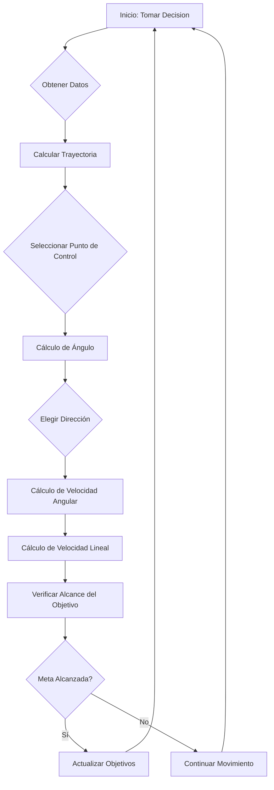

# 🤖 Proyecto de Sistemas Expertos para Control de Robots

Este proyecto implementa un sistema experto en Python para controlar el movimiento de un robot móvil en un entorno simulado sin obstáculos. El objetivo es que el robot recorra un segmento de línea en el plano con precisión y eficiencia. Para lograr esto, el proyecto está estructurado en varias clases que gestionan diferentes aspectos de la simulación y el control del robot.

## 🎯 Sistema Experto 1

### Descripción de las Clases

#### 1. `P1Launcher.py`
Esta clase inicializa y gestiona el entorno gráfico, asegurando la comunicación entre todos los objetos que intervienen en la simulación. Además, incluye los métodos necesarios para dibujar los elementos en la pantalla.

#### 2. `Robot.py`
Esta clase representa al robot móvil, almacenando su pose actual (posición y orientación en el plano) y procesando los comandos de velocidad lineal y angular que recibe del sistema experto. Internamente, esta clase se encarga de actualizar la pose del robot de acuerdo a su dinámica de movimiento, pero no se interactúa directamente con ella. Los datos de la pose del robot se utilizan como entrada en el sistema experto.

#### 3. `Objetivo.py`
Esta clase define un segmento lineal que representa el camino que el robot debe seguir en el plano. También permite configurar un triángulo de restricción: un área triangular definida por tres vértices donde el robot no debe ingresar. Esta configuración es especialmente útil para ejercicios avanzados en los que el robot debe evitar ciertas áreas mientras sigue el segmento objetivo.

#### 4. `expertSystem.py`
Esta clase es el núcleo del proyecto, en la que se implementa el sistema experto. En ella se desarrollan los métodos para calcular, en cada instante, los comandos de velocidad lineal y angular que el robot debe seguir para alcanzar el objetivo. Estos comandos se generan en función de la pose del robot y del segmento objetivo configurado.

---

## 🔍 Clase: ExpertSystem

### Índice

1. [Parámetros de Inicialización](#parámetros-de-inicialización)
   - [Indicadores y Estados de Trayectoria](#indicadores-y-estados-de-trayectoria)
   - [Parámetros de Velocidad y Movimiento](#parámetros-de-velocidad-y-movimiento)
   - [Parámetros de la Trayectoria Lineal](#parámetros-de-la-trayectoria-lineal)
   - [Parámetros de la Trayectoria Triangular](#parámetros-de-la-trayectoria-triangular)
   - [Ángulos y Control de Giro](#ángulos-y-control-de-giro)
   
2. [Metodos Principales](#metodos-principales)
   - [cubic_bezier](#cubic_bezier)
   - [generate_trajectory](#generate_trajectory)
   - [generate_linear_path](#generate_linear_path)
   - [calcular_offset](#calcular_offset)
   - [calculate_control_points](#calculate_control_points)
   - [normalize_angle](#normalize_angle)
   - [calcular_angulo](#calcular_angulo)
   - [decidir_modo_movimiento](#decidir_modo_movimiento)
   - [verificar_proximidad_objetivo](#verificar_proximidad_objetivo)
   - [obtener_coordenadas_objetivo](#obtener_coordenadas_objetivo)
   - [calcular_distancia_objetivo](#calcular_distancia_objetivo)
   - [calcular_velocidad_lineal](#calcular_velocidad_lineal)
   - [calcular_velocidad_angular](#calcular_velocidad_angular)
   - [tomar_decision](#tomar_decision)
   - [es_objetivo_alcanzado](#es_objetivo_alcanzado)
   - [hay_parte_optativa](#hay_parte_optativa)

---

## Parámetros de Inicialización

### Indicadores y Estados de Trayectoria
| Parámetro | Tipo | Descripción |
| --- | --- | --- |
| `objetivoAlcanzado` | `bool` | Indicador de si el robot ha alcanzado su objetivo final. |
| `segmentoObjetivo` | `object` | Segmento de destino actual en el trayecto. |
| `VOLVER_AL_INICIO` | `bool` | Controla si el robot debe regresar al punto inicial del trayecto. |
| `GO_AROUND_TRIANGLE` | `bool` | Indica si el robot debe rodear un obstáculo triangular. |
| `FRENAR` | `bool` | Indica si el robot debe frenar. |

### Parámetros de Velocidad y Movimiento
| Parámetro | Tipo | Descripción |
| --- | --- | --- |
| `velocidad` | `float` | Velocidad lineal inicial (en m/s). |
| `velocidad_angular` | `float` | Velocidad angular inicial (en rad/s). |
| `reverse` | `bool` | Modo de reversa inicial. |

### Parámetros de la Trayectoria Lineal
| Parámetro | Tipo | Descripción |
| --- | --- | --- |
| `check_point_segmento` | `int` | Estado del trayecto (punto inicial (False) o final (True)). |
| `LINE_CHECKPOINTS` | `int` | Cantidad de puntos de control en trayecto lineal. |
| `line_trayectory` | `list` | Lista de coordenadas del trayecto lineal. |
| `start_point` | `tuple` | Punto de inicio del trayecto. |
| `segment_number` | `int` | Número del segmento actual. |
| `distance` | `int` | Distancia hasta el punto objetivo. |
| `STOP_DISTANCE` | `float` | Distancia para detener el robot al final del segmento. |
| `CHECKPOINT_DISTANCE_ACTIVATOR` | `float` | Distancia que activa el cambio de punto de control. |
| `CONSTANTE_AUMENTAR_VELOCIDAD` | `float` | Constante para aumentar velocidad en trayecto. |
| `FIRST_SEGMENT_INDEX` | `int` | Índice del primer segmento del trayecto. |
| `TOTAL_SEGMENT_NUMBER` | `int` | Número total de segmentos en el trayecto. |

### Parámetros de la Trayectoria Triangular
| Parámetro | Tipo | Descripción |
| --- | --- | --- |
| `check_point_triangulo` | `int` | Contador de puntos de control en el trayecto triangular. |
| `TRIANGLE_CHECKPOINTS` | `int` | Cantidad de puntos de control en trayecto triangular. |
| `triangle_trayectory` | `list` | Lista de coordenadas del trayecto triangular. |
| `CONTROL_POINT_CONSTANT` | `float` | Constante de ajuste de puntos de control en trayecto triangular. |
| `TRIANGLE_SPEED` | `float` | Velocidad para movimiento triangular. |
| `MINIMUM_DISTANCE_TRIANGLE_CP` | `int` | Distancia mínima para activar puntos de control. |

### Ángulos y Control de Giro
| Parámetro | Tipo | Descripción |
| --- | --- | --- |
| `turn_angle_rad` | `float` | Ángulo de giro en radianes. |
| `turn_angle_deg` | `float` | Ángulo de giro en grados. |
| `REVERSE_THRESHOLD` | `int` | Umbral en grados para activar marcha atrás. |
| `MAXIMUM_ANGLE_DEG` | `int` | Ángulo máximo antes de desviarse del trayecto. |
| `DISTANCE_TURN_CONSTANT` | `float` | Constante para ajustar el ángulo máximo según la distancia. |
| `VELOCIDAD_ANGULAR_CONSTANT` | `int` | Constante para ajustar velocidad angular en giros. |

---

## Metodos Principales

### `cubic_bezier`
Calcula la posición en una curva cúbica de Bézier a partir de un valor `t` y cuatro puntos de control.

**Parámetros:**
- `t` (float): Valor en el rango [0, 1] para indicar la progresión a lo largo de la curva.
- `P0`, `P1`, `P2`, `P3` (`numpy.array`): Puntos de control de la curva.

**Retorno:**
- `numpy.array`: Coordenadas del punto en la curva correspondiente al valor `t`.

### `generate_trajectory`
Genera una trayectoria curva usando dos curvas de Bézier entre puntos de referencia dados.

**Parámetros:**
- `B`, `C`, `D` (`numpy.array`): Puntos clave de la trayectoria.
- `CP1`, `CP2` (`numpy.array`): Puntos de control para las curvas.

**Retorno:**
- `numpy.array`: Conjunto de puntos de la trayectoria generada.

### `generate_linear_path`
Genera una trayectoria lineal entre dos puntos `A` y `B`.

**Parámetros:**
- `A`, `B` (tupla o `numpy.array`): Coordenadas de los puntos de inicio y fin.

**Retorno:**
- Lista de puntos intermedios generados entre `A` y `B`.

### `calcular_offset`
Calcula un valor de "offset" para ajustar la curva basada en la distancia entre puntos de una trayectoria triangular.

**Parámetros:**
- `A`, `B`, `C` (tuplas): Coordenadas de los vértices del triángulo.

**Retorno:**
- `float`: Offset ajustado en un rango entre 0.5 y 1.5.

### `calculate_control_points`
Calcula los puntos de control que generan curvas suaves en la trayectoria.

**Parámetros:**
- `B`, `C`, `D` (`numpy.array`): Puntos clave de la trayectoria.

**Retorno:**
- `tuple`: Puntos de control `CP1` y `CP2`.

### `normalize_angle`
Normaliza un ángulo para que esté dentro del rango [-180, 180).

**Parámetro:**
- `angle` (float): Ángulo a normalizar.

**Retorno:**
- Ángulo normalizado (float).

### `calcular_angulo`
Calcula el ángulo entre la orientación actual y el objetivo.

**Parámetros:**
- `x_target`, `y_target` (float): Coordenadas del objetivo.
- `x_robot`, `y_robot` (float): Coordenadas actuales del robot.
- `current_angle` (float): Ángulo de orientación del robot.

**Retorno:**
- `tuple`: Ángulo hacia el objetivo y diferencia con el ángulo actual.

### `decidir_modo_movimiento`
Decide si el robot debe moverse en reversa según la diferencia angular.

**Parámetro:**
- `turn_angle_deg` (float): Diferencia angular.

**Retorno:**
- None.

### `verificar_proximidad_objetivo`
Determina si el robot ha alcanzado su objetivo y ajusta la velocidad.

**Parámetro:**
- `distance` (float): Distancia actual al objetivo.

**Retorno:**
- None.

### `obtener_coordenadas_objetivo`
Obtiene las coordenadas del próximo objetivo del robot en la trayectoria.

**Retorno:**
- `tuple`: Coordenadas `(x_target, y_target)` del objetivo.

### `calcular_distancia_objetivo`
Calcula la distancia euclidiana entre el robot y el objetivo.

**Parámetros:**
- `x_target` (float): Coordenada X del objetivo.
- `y_target` (float): Coordenada Y del objetivo.
- `x_robot` (float): Coordenada X actual del robot.
- `y_robot` (float): Coordenada Y actual del robot.

**Retorna:**
- `float`: Distancia euclidiana entre el robot y el objetivo.

### `calcular_velocidad_lineal`
Calcula y actualiza la velocidad lineal del robot en función del ángulo de giro y la distancia al objetivo.

**Parámetros:**
- `turn_angle_rad` (float): Ángulo de giro en radianes.
- `distance` (float): Distancia euclidiana entre el robot y el objetivo.

### `calcular_velocidad_angular`
Calcula y actualiza la velocidad angular del robot en función del ángulo de giro.

**Parámetros:**
- `turn_angle_rad` (float): Ángulo de giro en radianes.

### `tomar_decision`
> [!IMPORTANT]
> El método `tomarDecision` es el principal en el sistema experto. Se encarga de tomar decisiones basadas en la información actual del robot y el entorno. Se llama en cada ciclo de control del robot.

Toma una decisión de movimiento para el robot basado en su posición actual y la posición del objetivo en el segmento.

**Parámetros:**
- `poseRobot` (tuple): Una tupla que contiene la posición actual del robot y su ángulo de orientación en grados, en el formato `(x_robot, y_robot, current_angle)`.

**Retorna:**
- `tuple`: Una tupla con las velocidades lineal y angular calculadas `(velocidad, velocidad_angular)`.

### `es_objetivo_alcanzado`
Devuelve `True` cuando el punto final del objetivo ha sido alcanzado. Es responsabilidad de la alumna o alumno cambiar el valor de la variable `objetivoAlcanzado` cuando se detecte que el robot ha llegado a su objetivo. Esto se llevará a cabo en el método `tomarDecision`. Este método NO debería ser modificado.

**Retorna:**
- `bool`: `True` si el objetivo ha sido alcanzado, de lo contrario `False`.

### `hay_parte_optativa`
Método para verificar si hay una parte optativa en el proceso. Este método debe ser definido en base a la lógica del robot y su implementación.

---
# 🚀 **Lógica del Código**

La base del programa es la función `Tomar Decision`, que se llama de forma continua para controlar el movimiento del robot. Esta función realiza las siguientes acciones:

---

## 🔍 1. **Obtención de Datos y Cálculo de la Trayectoria**

La función reúne todos los datos necesarios para construir la trayectoria de movimiento. Para esto, se añaden puntos de control intermedios en cada segmento del camino: en segmentos rectos y en segmentos triangulares. Para cada tipo de segmento, se utilizan los métodos correspondientes definidos en la clase, lo que asegura que los puntos de control se establezcan correctamente.

### 📐 **Algoritmo de `obtener_coordenadas_objetivo`**

El algoritmo en la función `obtener_coordenadas_objetivo` está diseñado para obtener las coordenadas del objetivo del robot en función de su estado actual y posición, así como del tipo de trayectoria. La función considera si el robot se mueve a lo largo de una línea o un triángulo y actualiza dinámicamente las coordenadas del objetivo. Esto permite al robot seguir una trayectoria compleja correctamente, reaccionando a los cambios en el camino.

#### 📋 **Lógica General y Estructura de la Función**

1. **Determinación del Tipo de Trayectoria**  
   Primero, la función verifica el tipo de camino por el que se mueve el robot, ya sea una línea (segmento) o un triángulo.

2. **Retorno al Inicio (si es Necesario)**  
   Si el robot ha alcanzado el punto final de la ruta y necesita regresar al punto de inicio, la función devuelve las coordenadas del primer checkpoint.

#### 📈 **Generación de Trayectoria para el Segmento**

Para una línea, la función utiliza el método `generate_linear_path`, que forma una trayectoria recta entre dos puntos (inicio y fin del segmento). El proceso es el siguiente:

1. **Determinación de las Coordenadas de Inicio y Fin**  
   Usando las coordenadas de inicio y fin del segmento, la función divide el camino en un número determinado de puntos intermedios, definiendo una secuencia precisa de movimiento.

2. **Comprobación de los Checkpoints**  
   La función determina si el robot está en el inicio, en el medio o en el final del segmento. Si es el checkpoint inicial, se empieza a generar la trayectoria; si es el último checkpoint, el robot se detiene o se da la vuelta según las condiciones actuales.

3. **Movimiento a lo Largo de la Trayectoria**  
   En cada paso, la función actualiza las coordenadas del objetivo, asegurando un movimiento fluido a lo largo de la línea. La trayectoria lineal es simple y no requiere cálculos adicionales para ajustar la dirección.

#### 📐 **Generación de Trayectoria para el Triángulo**

Para el movimiento a lo largo de una trayectoria triangular, la función utiliza el algoritmo de Bézier. La generación de una trayectoria triangular es más compleja, ya que requiere la creación de curvas suaves.

1. **Algoritmo de Bézier**  
   El algoritmo de Bézier permite crear curvas suaves, lo cual es importante para mover al robot en una trayectoria de forma no estándar, como un triángulo. Este algoritmo utiliza cuatro puntos de control para crear una curva que conecta suavemente el inicio, el medio y el fin de la trayectoria triangular. La función `cubic_bezier` se encarga de calcular las posiciones a lo largo de esta curva en cada segmento.

2. **Generación del Camino Curvo**  
   Primero, la función determina dos puntos de control intermedios (CP1 y CP2), que definen la forma de la curva. Usando `generate_trajectory`, la función crea dos curvas de Bézier: una que conecta el primer y segundo puntos del triángulo, y otra que conecta el segundo y tercer puntos.

3. **Movimiento a lo Largo de la Trayectoria**  
   El robot se mueve a lo largo de los puntos calculados en la trayectoria, cumpliendo un número determinado de checkpoints para cada parte del triángulo. Esto asegura un movimiento fluido y preciso en la trayectoria triangular, algo que no se podría lograr con una interpolación lineal.

---

## 🔄 2. **Selección de Dirección y Cálculo del Ángulo de Giro**

Después de crear la trayectoria y seleccionar el punto de control adecuado, se calcula el ángulo necesario para girar. Dependiendo del ángulo, se elige el modo de movimiento: avance o marcha atrás (reversa). Si es necesario retroceder, se ejecutan funciones adicionales para implementar el movimiento en reversa.

### 🧭 **Definir la Dirección de Movimiento y el Ángulo de Giro**

1. **Calcular el Ángulo hacia el Objetivo**  
   Utilizando el método `calcular_angulo`.

2. **Elegir la Dirección de Movimiento**  
   Basado en la diferencia de ángulos con la dirección actual del robot, mediante la función `decidir_modo_movimiento`.

### 🔧 **Detalles del Funcionamiento de las Funciones**

#### 🔢 `calcular_angulo`

| **Parámetros de Entrada** | **Descripción**                      |
|---------------------------|--------------------------------------|
| `x_target`, `y_target`    | Coordenadas del objetivo             |
| `x_robot`, `y_robot`      | Coordenadas actuales del robot       |
| `current_angle`           | Ángulo actual de orientación (°)     |

**Proceso:**

1. **Cálculo del Ángulo hacia el Objetivo**  
   Determina el ángulo desde el robot hasta el objetivo usando `atan2`.

2. **Conversión a Grados**  
   Convierte el ángulo de radianes a grados.

3. **Normalización de los Ángulos**  
   Normaliza el ángulo hacia el objetivo y el ángulo actual del robot.

4. **Cálculo de la Diferencia Angular**  
   Calcula la diferencia entre el ángulo hacia el objetivo y la dirección actual del robot.

#### 🔢 `decidir_modo_movimiento`

| **Parámetro de Entrada** | **Descripción**                           |
|--------------------------|-------------------------------------------|
| `turn_angle_deg`         | Ángulo de giro calculado hacia el objetivo |

**Lógica de Elección de Dirección:**

- **Reversa o Adelante**  
  Si el ángulo de giro excede `REVERSE_THRESHOLD`, activa el modo reversa (`self.reverse = True`); de lo contrario, avanza.

- **Ajuste del Ángulo para Reversa:**  
  ```python
  if self.reverse:
      self.turn_angle_deg = self.normalize_angle(self.turn_angle_deg - 180)  # Ajustar el ángulo para reversa
  ```

---

## 🏎️ 3. **Cálculo de la Velocidad Angular y Lineal**

Según la posición actual del robot y la dirección elegida, se calculan la velocidad angular y lineal. También se determina la distancia al punto de destino para establecer correctamente la velocidad lineal, lo que permite un movimiento suave.

### 🧮 **Lógica General y Estructura de la Función**

1. **Cálculo de la Velocidad Angular**  
   Método: `calcular_velocidad_angular`

2. **Cálculo de la Distancia al Objetivo**  
   Método: `calcular_distancia_objetivo`

3. **Cálculo de la Velocidad Lineal**  
   Método: `calcular_velocidad_lineal`

#### 🌀 **`calcular_velocidad_angular`**

**Parámetro de Entrada:**

| **Nombre**        | **Descripción**                  |
|-------------------|----------------------------------|
| `turn_angle_rad`  | Ángulo de giro en radianes       |

**Proceso:**

1. **Cálculo de la Velocidad Angular**  
   ```python
   self.velocidad_angular = turn_angle_rad * WACC * self.VELOCIDAD_ANGULAR_CONSTANT
   ```

2. **Limitación de la Velocidad Angular**  
   ```python
   self.velocidad_angular = max(-WMAX, min(WMAX, self.velocidad_angular))
   ```

3. **Ajuste para Segmentos Triangulares**  
   ```python
   if self.segmentoObjetivo.getType() == 2:
       self.velocidad_angular *= 1.5
   ```

#### 📏 **`calcular_distancia_objetivo`**

**Parámetros de Entrada:**

| **Nombre**        | **Descripción**                  |
|-------------------|----------------------------------|
| `x_target`, `y_target` | Coordenadas del objetivo     |
| `x_robot`, `y_robot`   | Coordenadas actuales del robot |

**Valor de Retorno:**
- Distancia euclidiana entre el robot y el objetivo.

**Fórmula:**
```python
distancia = math.sqrt((x_target - x_robot) ** 2 + (y_target - y_robot) ** 2)
```

#### 🏃 **`calcular_velocidad_lineal`**

**Parámetros de Entrada:**

| **Nombre**            | **Descripción**                          |
|-----------------------|------------------------------------------|
| `turn_angle_rad`      | Ángulo de giro en radianes               |
| `distance`            | Distancia euclidiana al objetivo         |

**Proceso:**

1. **Condiciones para el Segmento Lineal:**

   - **Primer Checkpoint y Ángulo Bajo:**
     ```python
     if abs(turn_angle_rad) < math.radians(distance * self.DISTANCE_TURN_CONSTANT) or \
        abs(turn_angle_rad) < math.radians(self.MAXIMUM_ANGLE_DEG):
         self.velocidad = min(VMAX, distance * VACC * self.CONSTANTE_AUMENTAR_VELOCIDAD)
     ```
   - **No Primer Checkpoint y Ángulo Bajo:**
     ```python
     else:
         self.velocidad = 3
     ```
   - **Otras Condiciones:**
     ```python
     self.velocidad = 0
     ```

2. **Condiciones para el Segmento Triangular:**
   ```python
   velocidad_angular_factor = max(0, 1 - abs(turn_angle_rad) / math.radians(90))
   self.velocidad = min(VMAX, distance * VACC * self.TRIANGLE_SPEED * velocidad_angular_factor)
   ```

---

## 🎯 4. **Verificación de Alcance de la Meta**

En cada etapa, se verifica si el robot ha alcanzado su punto de destino. Si se ha llegado a la meta, el movimiento continúa hacia el siguiente punto de control o termina.

### 🧩 **Lógica General y Estructura de la Función**

El método `verificar_proximidad_objetivo` gestiona la proximidad del robot al objetivo y la lógica asociada para detenerse, activar puntos de control y reducir la velocidad suavemente.

#### 📋 **Proceso General de la Función**

**Parámetro de Entrada:**

| **Nombre** | **Descripción**                       |
|------------|---------------------------------------|
| `distance` | Distancia actual entre el robot y el objetivo |

#### 📏 **Lógica para Segmentos Lineales**

1. **Condición de Detención:**
   ```python
   if distance <= self.STOP_DISTANCE and self.check_point_segmento == len(self.line_trayectory)-1:
       self.objetivoAlcanzado = True
       self.segment_number += 1
   ```

   - **Control de Lógica para Volver al Inicio:**
     ```python
     self.objetivoAlcanzado = self.segment_number != self.TOTAL_SEGMENT_NUMBER if self.VOLVER_AL_INICIO else True
     ```
   - **Reinicio del Contador de Puntos de Control:**
     ```python
     self.check_point_segmento = 0
     ```

2. **Activación de Puntos de Control:**
   ```python
   elif distance < self.CHECKPOINT_DISTANCE_ACTIVATOR and self.check_point_segmento < len(self.line_trayectory) - 1:
       self.check_point_segmento += 1
   ```

3. **Reducción Suave de la Velocidad:**
   ```python
   if self.FRENAR:
       stop_distance = (self.velocidad ** 2) / (2 * VACC)
       if distance <= stop_distance:
           self.velocidad *= (distance / stop_distance)
   ```

#### 📏 **Lógica para Segmentos Triangulares**

1. **Condición de Detención:**
   ```python
   if distance <= 0.5 and self.check_point_triangulo == (self.TRIANGLE_CHECKPOINTS * 2) - 1:
       self.objetivoAlcanzado = True
       self.check_point_triangulo = 0
   ```

2. **Activación de Puntos de Control:**
   ```python
   elif distance <= self.MINIMUM_DISTANCE_TRIANGLE_CP and self.check_point_triangulo <= (self.TRIANGLE_CHECKPOINTS * 2) - 2:
       self.check_point_triangulo += 1
   ```

3. **Reducción Suave de la Velocidad:**
   ```python
   elif self.FRENAR:
       stop_distance = (self.velocidad ** 2) / (2 * VACC)
       if distance <= stop_distance:
           self.velocidad *= (distance / stop_distance)
   ```

---

## 🏁 5. **Retorno de Parámetros de Velocidad**

Al finalizar, la función devuelve los valores de velocidad lineal y angular, los cuales se transmiten para controlar el movimiento del robot.

```python
return self.velocidad, self.velocidad_angular
```

---

## 📊 **Diagrama de Flujo de la Función `Tomar Decision`**



---

## 📚 **Resumen de Métodos Clave**

| **Método**                    | **Descripción**                                                                                     |
|-------------------------------|-----------------------------------------------------------------------------------------------------|
| `obtener_coordenadas_objetivo`| Obtiene las coordenadas del objetivo según el estado actual y tipo de trayectoria.                  |
| `generate_linear_path`        | Genera una trayectoria lineal entre dos puntos con checkpoints intermedios.                        |
| `cubic_bezier`                | Calcula posiciones a lo largo de una curva de Bézier para trayectorias triangulares.               |
| `calcular_angulo`             | Calcula el ángulo de giro necesario hacia el objetivo.                                             |
| `decidir_modo_movimiento`     | Determina si el robot debe moverse hacia adelante o en reversa basado en el ángulo de giro.         |
| `calcular_velocidad_angular`  | Calcula y ajusta la velocidad angular del robot para un giro suave y controlado.                    |
| `calcular_distancia_objetivo` | Calcula la distancia euclidiana entre el robot y el objetivo.                                      |
| `calcular_velocidad_lineal`   | Ajusta la velocidad lineal del robot basada en el ángulo de giro y la distancia al objetivo.        |
| `verificar_proximidad_objetivo`| Verifica si el robot ha alcanzado el objetivo y maneja la lógica para avanzar al siguiente punto. |

---

## 🛠 **Constantes y Parámetros Clave**

| **Constante/Parámetro**            | **Descripción**                                                                                         |
|------------------------------------|---------------------------------------------------------------------------------------------------------|
| `WACC`                             | Coeficiente de aceleración angular.                                                                     |
| `WMAX`                             | Velocidad angular máxima permitida.                                                                     |
| `VELOCIDAD_ANGULAR_CONSTANT`       | Constante que determina la relación entre el ángulo de giro y la velocidad angular.                     |
| `VMAX`                             | Velocidad máxima lineal.                                                                                 |
| `VACC`                             | Coeficiente de aceleración lineal.                                                                       |
| `CONSTANTE_AUMENTAR_VELOCIDAD`     | Constante para determinar la velocidad en función de la distancia.                                       |
| `TRIANGLE_SPEED`                   | Constante que define la velocidad para movimientos en segmentos triangulares.                           |
| `REVERSE_THRESHOLD`                | Umbral de ángulo para decidir movimiento en reversa.                                                    |
| `DISTANCE_TURN_CONSTANT`           | Constante para ajustar la relación entre distancia y ángulo de giro en segmentos lineales.               |
| `MAXIMUM_ANGLE_DEG`                | Ángulo máximo permitido para considerar el movimiento hacia adelante sin reversa.                        |
| `STOP_DISTANCE`                    | Distancia mínima para considerar que el objetivo ha sido alcanzado.                                      |
| `CHECKPOINT_DISTANCE_ACTIVATOR`     | Distancia para activar el siguiente checkpoint.                                                          |
| `MINIMUM_DISTANCE_TRIANGLE_CP`     | Distancia mínima para activar el siguiente checkpoint en segmentos triangulares.                         |
| `VOLVER_AL_INICIO`                 | Booleano para determinar si el robot debe volver al inicio tras completar la ruta.                        |
| `TOTAL_SEGMENT_NUMBER`             | Número total de segmentos en la trayectoria.                                                             |
| `TRIANGLE_CHECKPOINTS`             | Número de checkpoints por segmento triangular.                                                          |
| `FRENAR`                           | Booleano que indica si se debe activar la frenada suave.                                                |

---

## 📌 **Notas Adicionales**

- **Modularidad del Código:** Cada función está diseñada para realizar una tarea específica, facilitando el mantenimiento y la escalabilidad del programa.
- **Optimización del Movimiento:** El cálculo dinámico de ángulos y velocidades asegura que el robot se adapte a diferentes tipos de trayectorias y condiciones de movimiento.
- **Seguridad:** La limitación de velocidades y la verificación continua de la proximidad al objetivo previenen movimientos bruscos y posibles colisiones.

---
