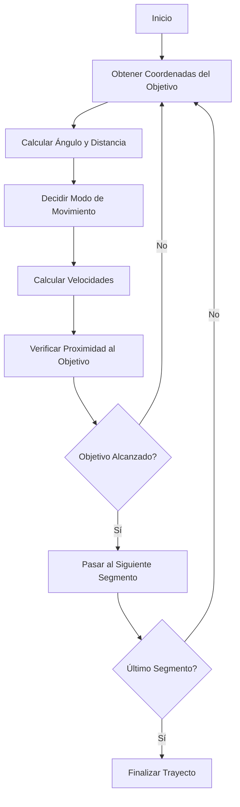

# Documentación del Sistema Experto para el Guiado de un Robot 🤖

## Introducción 🌟

Este proyecto es un sistema experto diseñado para controlar y guiar un robot móvil sobre un plano cartesiano. El robot sigue una línea recta desde un punto inicial hasta un punto final, evitando obstáculos y ajustando su trayectoria según sea necesario. El sistema utiliza una serie de algoritmos y métodos para calcular la velocidad y la dirección del robot, asegurando un movimiento suave y preciso.

## Estructura del Proyecto 🧩

El proyecto se compone de varios módulos y clases que trabajan en conjunto para lograr el objetivo del robot. A continuación, se describen las principales clases y su función:

### Clase `Launcher` 🏁
- **Función**: Inicializa y lanza el sistema experto.
- **Responsabilidades**: Configurar el entorno, cargar los objetivos del trayecto y gestionar la ejecución del sistema experto.

### Clase `Robot` 🤖
- **Función**: Representa al robot móvil.
- **Responsabilidades**: Almacenar y actualizar la posición y orientación del robot, así como sus velocidades lineal y angular.

### Clase `Segmento` 📏
- **Función**: Define los segmentos del trayecto.
- **Responsabilidades**: Almacenar los puntos inicial, medio y final de cada segmento, y determinar el tipo de segmento (lineal o triangular).

### Clase `ExpertSystem` 🧠
- **Función**: Sistema experto que toma decisiones para guiar al robot.
- **Responsabilidades**: Calcular la trayectoria, ajustar la velocidad y dirección del robot, y gestionar la lógica de evasión de obstáculos.

## 📦 Variables en el Constructor de `ExpertSystem`

El constructor de la clase `ExpertSystem` inicializa varias variables importantes:

- **Estados Generales**:
  - `objetivoAlcanzado`: Indica si el robot ha alcanzado su objetivo.
  - `segmentoObjetivo`: Segmento objetivo actual.
  - `VOLVER_AL_INICIO`: Indica si el robot debe regresar al inicio.
  - `GO_AROUND_TRIANGLE`: Indica si el robot debe rodear un obstáculo triangular.
  - `FRENAR`: Indica si el robot debe frenar.

- **Velocidades y Movimiento**:
  - `velocidad`: Velocidad lineal inicial.
  - `velocidad_angular`: Velocidad angular inicial.
  - `reverse`: Indica si el robot está en modo reversa.
  - `distance`: Distancia al objetivo actual.

- **Parámetros de Trayectoria Lineal**:
  - `check_point_segmento`: Índice del punto de control actual.
  - `LINE_CHECKPOINTS`: Total de puntos de control en trayectoria lineal.
  - `line_trayectory`: Coordenadas de la trayectoria lineal.
  - `start_point`: Punto de inicio de la trayectoria.
  - `segment_number`: Número del segmento actual.
  - `STOP_DISTANCE`: Distancia para detenerse al final del segmento.
  - `CHECKPOINT_DISTANCE_ACTIVATOR`: Distancia que activa cambio de punto de control.
  - `CONSTANTE_AUMENTAR_VELOCIDAD`: Constante para aumentar velocidad.
  - `FIRST_SEGMENT_INDEX`: Índice del primer segmento.
  - `TOTAL_SEGMENT_NUMBER`: Número total de segmentos.
  - `LINE_EXPANSION_FACTOR`: Factor para extender el punto inicial de la trayectoria lineal.

- **Parámetros de Trayectoria Triangular**:
  - `check_point_triangulo`: Índice del punto de control actual en trayectoria triangular.
  - `MAX_TRIANGLE_CHECKPOINTS`: Total de puntos de control en trayectoria triangular.
  - `CURRENT_TRIANGLE_CHECKPOINTS`: Puntos actuales en la trayectoria triangular.
  - `triangle_trayectory`: Coordenadas de la trayectoria triangular.
  - `CONTROL_POINT_CONSTANT`: Constante para ajustar los puntos de control.
  - `TRIANGLE_SPEED`: Velocidad para movimiento triangular.
  - `MINIMUM_DISTANCE_TRIANGLE_CP`: Distancia mínima para activar puntos de control.
  - `CURVE_EXPANSION_FACTOR`: Factor para expansión de curvas.
  - `CURVE_CONTROLL_POINTS_OFFSET`: Desplazamiento de puntos de control en curvas.

- **Ángulos y Control de Giros**:
  - `turn_angle_rad`: Ángulo de giro en radianes.
  - `turn_angle_deg`: Ángulo de giro en grados.
  - `REVERSE_THRESHOLD`: Umbral en grados para activar marcha atrás.
  - `MAXIMUM_ANGLE_DEG`: Ángulo máximo antes de desviarse.
  - `DISTANCE_TURN_CONSTANT`: Constante para ajustar ángulo según distancia.
  - `VELOCIDAD_ANGULAR_CONSTANT`: Constante para ajustar velocidad angular.
  
## Métodos de la Clase `ExpertSystem` 🛠️

### Métodos Principales

- **`setObjetivo(self, segmento)`**: Especifica un segmento como objetivo para el recorrido del robot.
- **`tomarDecision(self, poseRobot)`**: Toma una decisión de movimiento para el robot basado en su posición actual y la posición del objetivo en el segmento.
- **`esObjetivoAlcanzado(self)`**: Devuelve `True` cuando el punto final del objetivo ha sido alcanzado.
- **`hayParteOptativa(self)`**: Devuelve `True` si hay una parte optativa en el trayecto.

### Métodos de Control de Curvas

- **`cubic_bezier(self, t, P0, P1, P2, P3)`**: Calcula una posición en una curva cúbica de Bézier.
- **`calcular_offset(self, A, B, C)`**: Calcula el offset para una trayectoria curva que pasa por el triángulo ABC.
- **`calculate_control_points(self, B, C, D)`**: Calcula los puntos de control que definen las curvas fuera de la línea entre los puntos clave.
- **`move_point_C_perpendicular(self, B, C, D)`**: Desplaza el punto C hacia arriba en relación con el segmento B-D a una distancia dada.
- **`find_circumcenter(self, B, C, D)`**: Encuentra el circuncentro del triángulo definido por los puntos B, C y D.
- **`add_point_above_D(self, B, C, D)`**: Crea tres puntos por encima del punto D que son perpendiculares al segmento B-D.
- **`generate_curved_path(self, B, C, D)`**: Genera una trayectoria utilizando dos curvas de Bézier cúbicas que pasan por los puntos B, C y D.

### Métodos de Control de Líneas

- **`generate_point_on_extension(self, A, B)`**: Genera un punto en la extensión de la línea definida por los puntos A y B.
- **`generate_linear_path(self, A, B)`**: Genera una trayectoria lineal entre los puntos A y B, incluyendo puntos intermedios.

### Métodos de Cálculo y Normalización

- **`normalize_angle(self, angle)`**: Normaliza un ángulo al rango [-180, 180) grados.
- **`calcular_angulo(self, x_target, y_target, x_robot, y_robot, current_angle)`**: Calcula el ángulo hacia el objetivo, normaliza los ángulos y calcula la diferencia angular.
- **`decidir_modo_movimiento(self, turn_angle_deg)`**: Decide el modo de movimiento del robot.
- **`verificar_proximidad_objetivo(self, distance)`**: Verifica la proximidad del robot al objetivo y gestiona la lógica de parada, activación de checkpoints, y reducción suave de la velocidad.
- **`obtener_coordenadas_objetivo(self)`**: Determina las coordenadas del objetivo actual en función del estado del robot y el segmento en el que se encuentra.
- **`calcular_distancia_objetivo(self, x_target, y_target, x_robot, y_robot)`**: Calcula la distancia euclidiana entre el robot y el objetivo.
- **`calcular_velocidad_lineal(self, turn_angle_rad, distance)`**: Calcula y actualiza la velocidad lineal del robot en función del ángulo de giro y la distancia al objetivo.
- **`calcular_velocidad_angular(self, turn_angle_rad)`**: Calcula y actualiza la velocidad angular del robot en función del ángulo de giro.

## Algoritmo Completo 🧠

El algoritmo del sistema experto sigue los siguientes pasos:

1. **Inicialización**: Se inicializan las variables y se cargan los objetivos del trayecto.
2. **Ciclo de Decisión**: En cada iteración, el sistema:
   - Obtiene las coordenadas del objetivo actual.
   - Calcula el ángulo y la distancia al objetivo.
   - Decide el modo de movimiento (adelante o reversa).
   - Calcula las velocidades lineal y angular.
   - Verifica la proximidad al objetivo y gestiona la lógica de parada y activación de checkpoints.
3. **Actualización de la Posición**: Se actualiza la posición del robot según las velocidades calculadas.
4. **Verificación de Objetivo Alcanzado**: Si el objetivo es alcanzado, se pasa al siguiente segmento o se finaliza el trayecto.

## Gráfico del Ciclo de Trabajo del Robot 📊

## Detalles Adicionales 📝

- **Evasión de Obstáculos**: El sistema incluye lógica para evitar obstáculos triangulares, generando trayectorias curvas alrededor de ellos.
- **Control de Velocidad**: La velocidad del robot se ajusta dinámicamente en función de la distancia al objetivo y el ángulo de giro, asegurando un movimiento suave y preciso.
- **Modo Reversa**: El robot puede moverse en reversa si el ángulo de giro es mayor que un umbral definido, optimizando así la trayectoria.

Este sistema experto es una solución robusta y flexible para el control de robots móviles, capaz de manejar una variedad de escenarios y desafíos en el entorno de navegación. 🚀
